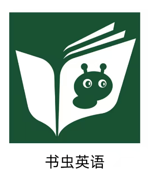

# 书虫

使用这个 app 可以免费听，还不错的。

学习英语,英语听力 2000 小时入门。短时间大量输入，快速看到效果，得到正反馈。

## 简介

牛津英语书虫系列是牛津大学出版社为英语学习者打造的分级读物，以下是具体分级介绍：

- **入门级**：词汇量约 300 - 600，以简单日常词汇为主。句子简短、结构单一，多为简单陈述句。内容贴近生活，如小动物、小朋友的日常活动，配有大量图片辅助理解，适合零基础或英语启蒙读者。
- **一级**：词汇量约 600 - 1000，句子变长、结构稍复杂，出现简单复合句。故事有更多生活场景，如家庭、学校生活等，适合小学高年级和初一学生。代表书目有《爱情与金钱》《歌剧院的幽灵》等。
- **二级**：词汇量约 1000 - 1500，句子结构更多样，从句使用增加。故事题材丰富，有冒险、童话等，情节更有起伏，适合初一到初二学生。例如《威廉·莎士比亚》《一个国王的爱情故事》等。
- **三级**：词汇量约 1500 - 2000，语言表达更地道，复合句频繁，出现习语和固定搭配。故事涉及历史、文化、悬疑等主题，情节曲折，适合初二到初三学生。像上册的《爱丽丝镜中世界奇遇记》《风语河岸柳》，下册的《圣诞欢歌》《多里安·格雷的画像》等。
- **四级**：词汇量约 2000 - 2500，对语法和词汇要求提高，有较难语法现象。故事多取材经典文学作品，风格和内容更成熟，适合初三到高一学生。比如上册的《巴斯克维尔的猎犬》《小妇人》，下册的《远大前程》《双城记》等。
- **五级**：词汇量约 2500 左右，语言难度进一步提升，文学性更强，句式复杂。内容为经典文学作品简写版，如《大卫·科波菲尔》《远离尘嚣》等，帮助读者领略经典魅力，适合高一学生。
- **六级**：词汇量 2500 以上，语言接近原著水平，有大量文学性表达、复杂句式和高级词汇。多为世界名著，如《简·爱》《呼啸山庄》《傲慢与偏见》《苔丝》等，适合高二、高三学生 ，提升英语综合素养和文学鉴赏能力。

## 入门级

词汇量 300

1. [亚瑟王传奇](./入门级/亚瑟王传奇/README.md)
